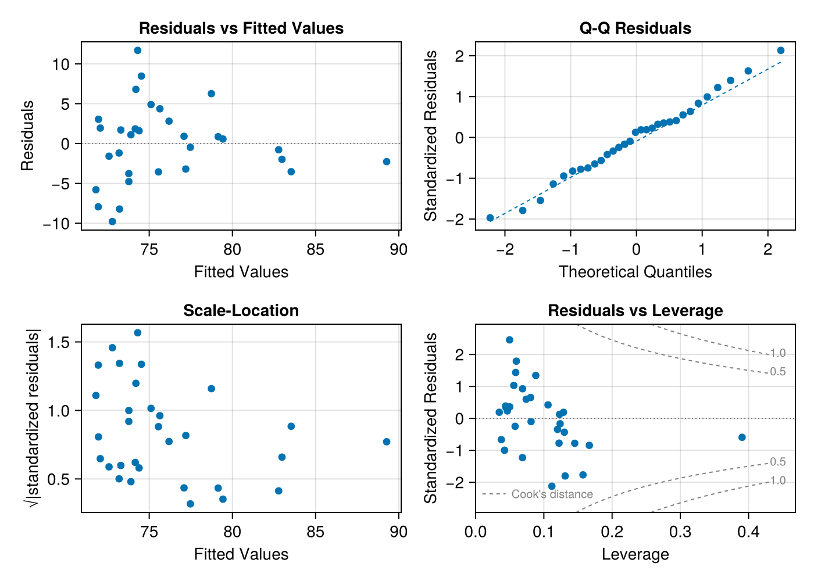

# GLMMakie.jl

[](https://github.com/irregular-rhomboid/GLMMakie.jl/actions/workflows/CI.yml?query=branch%3Amain)
[](https://codecov.io/gh/irregular-rhomboid/GLMMakie.jl)

Summary Plots for `GLM.jl` using Makie.

This package implements the equivalent of R's `plot.lm` function for GLM' `LinearModels` objects, using Makie Recipes.

## Installation

```
] add https://github.com/irregular-rhomboid/GLMMakie.jl.git
```

## Usage

```julia
using GLM
using RDatasets
using CairoMakie
using GLMMakie

data = dataset("datasets", "trees")

@time l = lm(@formula(Height ~ Girth + Volume), data)

# the main plot function displays a figure with four summary plots
lmplot(l; size = (700,500))
```



Functions for the individual plots are available, though because of the way Makie recipes work, they do not have labels or annotations.

```julia
residualplot(l)
qqplot(l)
scalelocationplot(l)
residualsleverageplot(l)
cooksleverageplot(l)
```

